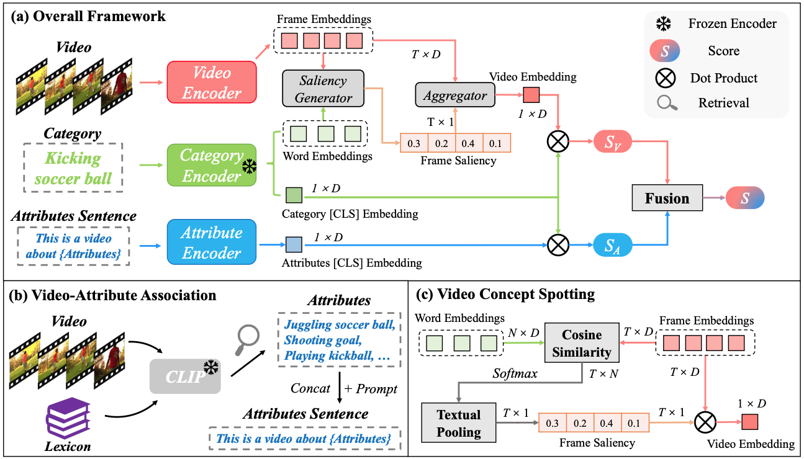

<div align="center">

<h2>【CVPR'2023】🚴 BIKE: Bidirectional Cross-Modal Knowledge Exploration for Video Recognition with Pre-trained Vision-Language Models </h2>

[](https://cvpr.thecvf.com/)
[](https://arxiv.org/abs/2301.00182)


<!-- <h3><a href="https://arxiv.org/abs/2301.00182">Bidirectional Cross-Modal Knowledge Exploration for Video Recognition with Pre-trained Vision-Language Models</a></h3> -->

[Wenhao Wu](https://whwu95.github.io/)<sup>1,2</sup>, [Xiaohan Wang](https://scholar.google.com/citations?user=iGA10XoAAAAJ&hl=en)<sup>3</sup>, [Haipeng Luo]()<sup>4</sup>, [Jingdong Wang](https://jingdongwang2017.github.io/)<sup>2</sup>, [Yi Yang](https://scholar.google.com/citations?user=RMSuNFwAAAAJ&hl=en)<sup>3</sup>, [Wanli Ouyang](https://wlouyang.github.io/)<sup>5,1</sup>

 
<sup>1</sup>[The University of Sydney](https://www.sydney.edu.au/), <sup>2</sup>[Baidu](https://vis.baidu.com/#/), <sup>3</sup>[ZJU](https://www.zju.edu.cn/english/), <sup>4</sup>[UCAS](https://english.ucas.ac.cn/), <sup>5</sup>[Shanghai AI Lab](https://www.shlab.org.cn/)


</div>

***

[](https://paperswithcode.com/sota/action-recognition-in-videos-on-ucf101?p=bidirectional-cross-modal-knowledge)
[](https://paperswithcode.com/sota/action-recognition-in-videos-on-activitynet?p=bidirectional-cross-modal-knowledge)
[](https://paperswithcode.com/sota/action-recognition-in-videos-on-hmdb-51?p=bidirectional-cross-modal-knowledge)
[](https://paperswithcode.com/sota/action-classification-on-kinetics-400?p=bidirectional-cross-modal-knowledge)
[](https://paperswithcode.com/sota/action-classification-on-charades?p=bidirectional-cross-modal-knowledge)
[](https://paperswithcode.com/sota/zero-shot-action-recognition-on-ucf101?p=bidirectional-cross-modal-knowledge)
[](https://paperswithcode.com/sota/zero-shot-action-recognition-on-hmdb51?p=bidirectional-cross-modal-knowledge)
[](https://paperswithcode.com/sota/zero-shot-action-recognition-on-kinetics?p=bidirectional-cross-modal-knowledge)
[](https://paperswithcode.com/sota/zero-shot-action-recognition-on-activitynet?p=bidirectional-cross-modal-knowledge)


This is the official implementation of our 🚴 **BIKE** (BIdirectional Knowledge Exploration), which leverages cross-modal bridge to enhance video recognition by exploring bidirectional knowledge.


<details open><summary>📣 I also have other cross-modal video projects that may interest you ✨. </summary><p>


> [**Revisiting Classifier: Transferring Vision-Language Models for Video Recognition**](https://arxiv.org/abs/2207.01297)<br>
> Accepted by AAAI 2023 | [[Text4Vis Code]](https://github.com/whwu95/Text4Vis)<br>
> Wenhao Wu, Zhun Sun, Wanli Ouyang


> [**Cap4Video: What Can Auxiliary Captions Do for Text-Video Retrieval?**](https://arxiv.org/abs/2301.00184)<br>
> Accepted by CVPR 2023 as 🌟Highlight🌟 | [[Cap4Video Code]](https://github.com/whwu95/Cap4Video)<br>
> Wenhao Wu, Haipeng Luo, Bo Fang, Jingdong Wang, Wanli Ouyang

</p></details>

## News
-  🚀 **Efficient Training**: Almost all models can be trained using **8 NVIDIA V100 GPUs**. Especially, we can train ViT-L/14 (336) backbone with 8 frames using **8 GPUs** and achieve **88.3%** Top-1 accuracy on Kinetics-400!
-  `Apr 26, 2023`: All models, configs and training logs have been released.
-  `Apr 20, 2023`: Main training codes have been released, including single-node/multi-node multi-GPU distributed training. Thanks for your star 😝.
-  `Feb 28, 2023`: 🎉Our **BIKE** has been accepted by **CVPR-2023**.

## Overview
🚴**BIKE** explores bidirectional cross-modal knowledge from the pre-trained vision-language model (e.g., CLIP) to introduce auxiliary attributes and category-dependent temporal saliency for improved video recognition.




## Content
- [Prerequisites](#prerequisites)
- [Data Preparation](#data-preparation)
- [Model Zoo](#model-zoo)
- [Training](#training)  
- [Testing](#testing)  
- [BibTeX & Citation](#bibtex)
- [Acknowledgment](#acknowledgment)

<a name="prerequisites"></a>
## Prerequisites

<details><summary>The code is built with following libraries. </summary><p>

- [PyTorch](https://pytorch.org/) >= 1.8
- RandAugment
- pprint
- tqdm
- dotmap
- yaml
- csv
- Optional: decord (for on-the-fly video training)
- Optional: torchnet (for mAP evaluation on ActivityNet)
</p></details>


<a name="data-preparation"></a>
## Data Preparation


### Video Loader

**(Recommend)** To train all of our models, we extract videos into frames for fast reading. Please refer to [MVFNet](https://github.com/whwu95/MVFNet/blob/main/data_process/DATASETS.md) repo for the detailed guide of dataset processing.  
The annotation file is a text file with multiple lines, and each line indicates the directory to frames of a video, total frames of the video and the label of a video, which are split with a whitespace. 
<details open><summary>Example of annotation</summary>

```sh
abseiling/-7kbO0v4hag_000107_000117 300 0
abseiling/-bwYZwnwb8E_000013_000023 300 0
```
</details>

(Optional) We can also decode the videos in an online fashion using [decord](https://github.com/dmlc/decord). This manner should work but are not tested. All of the models offered have been trained using offline frames. 
<details><summary>Example of annotation</summary>

```sh
  abseiling/-7kbO0v4hag_000107_000117.mp4 0
  abseiling/-bwYZwnwb8E_000013_000023.mp4 0
```
</details>


### Annotation
Annotation information consists of two parts: video label, and category description.

- Video Label: As mentioned above, this part is same as the traditional video recognition. Please refer to [lists/k400/kinetics_rgb_train_se320.txt](lists/k400/kinetics_rgb_train_se320.txt) for the format.
- Category Description: We also need a textual description for each video category.  Please refer to [lists/k400/kinetics_400_labels.csv](lists/k400/kinetics_400_labels.csv) for the format.


<a name="model-zoo"></a>
## 📱 Model Zoo

- Firstly, we provide some GPU memory usage results during model training for your reference. 
- Then we provide some off-the-shelf pre-trained checkpoints of our models in the following tables.
  - *# Inference Views = # Temporal clips x # Spatial crops*


### Training GPU Memory

During our training, we maintain a total batch size of 256. 
If your machine's GPU memory is not enough, you can reduce the batch size to reduce the memory usage. It is best to correspondingly increase the value of "grad_accumulation_steps" in the config file.

Architecture | Input | Batch Size (per GPU) x 8GPUs  | Mem. (per GPU) |
:-: | :-: | :-: | :-: 
ViT-B/32 | 8x224<sup>2</sup> | 32 x 8 = 256 | 6G | 
ViT-B/16 | 8x224<sup>2</sup> | 32 x 8 = 256 | 9G | 
ViT-L/14 | 8x224<sup>2</sup> | 32 x 8 = 256 | 18G | 
ViT-L/14 | 16x224<sup>2</sup> | 32 x 8 = 256 | 29G |

### Kinetics-400

| Architecture | Input | Views | Top-1(%) | checkpoint | Train log| config| 
|:------------:|:-------------------:|:------------------:|:-----------------:|:--------------:|:--------------:|:--------------:|
| ViT-B/32 <sup>V+A</sup>  | 8x224<sup>2</sup> | 1x1 | 81.4| [Score](https://github.com/whwu95/BIKE/releases/download/v1.0/video_sentence_fusion.zip) | [log](exps/k400/ViT-B/32/8f/video_attributes_log.txt) | [config](configs/k400/k400_train_video_attr_vitb-32-f8.yaml) |
| ViT-B/16 | 8x224<sup>2</sup> | 4x3  | 84.0 | [Github](https://github.com/whwu95/BIKE/releases/download/v1.0/k400-vit-b-16-f8.pt) | [log](exps/k400/ViT-B/16/8f/log.txt) | [config](configs/k400/k400_train_rgb_vitb-16-f8.yaml) |
| ViT-L/14* | 8x224<sup>2</sup> | 4x3| 87.4 | [OneDrive](https://unisyd-my.sharepoint.com/:u:/g/personal/wenhao_wu_sydney_edu_au/EVXtv3sCJS1Nlti85qpi3_QB1hHN_CLHung4Z2VvGPOoIA?e=42UqzW) | [log](exps/k400/ViT-L/14/8f/log.txt) | [config](configs/k400/k400_train_rgb_vitl-14-f8.yaml) | 
| ViT-L/14 | 16x224<sup>2</sup> | 4x3| 88.1| [OneDrive](https://unisyd-my.sharepoint.com/:u:/g/personal/wenhao_wu_sydney_edu_au/ERNSsQiMmGpAi-VUodkUCrkB52-Lzc9dVen4XW6sN96u1A?e=ne239U) | [log](exps/k400/ViT-L/14/16f/log.txt) | [config](configs/k400/k400_train_rgb_vitl-14-f16.yaml) | 
| ViT-L/14 | 8x336<sup>2</sup> | 4x3  | 88.3 | [OneDrive](https://unisyd-my.sharepoint.com/:u:/g/personal/wenhao_wu_sydney_edu_au/EYSHPoWw0z1Pssh6jzQP-WYBgZA6wQceZulGlANJZP9GJw?e=83hYgv)  | [log](exps/k400/ViT-L/14-336px/8f/log.txt) | [config](configs/k400/k400_train_rgb_vitl-14-336-f8.yaml) |
| ViT-L/14 | 16x336<sup>2</sup> | 4x3  | 88.7 | [OneDrive](https://unisyd-my.sharepoint.com/:u:/g/personal/wenhao_wu_sydney_edu_au/ESSPEMX1OUBGl8YEAAt4KsABN0gey5Rw2608sdF86dc0Ig?e=An1LcU)  | [log](exps/k400/ViT-L/14-336px/16f/log.txt) | [config](configs/k400/k400_train_rgb_vitl-14-336-f16.yaml) |
<!-- | ViT-L/14 | 32x336<sup>2</sup> | 4x3  | xx.x | [OneDrive]() | [log](exps/k400/ViT-L/14-336px/32f/log.txt) | [config](configs/k400/k400_train_rgb_vitl-14-336-f32.yaml) | -->

- The V+A represents a model that includes both the video and attributes branches. If not specified, our other provided models default to the video branch model.
- The * indicates that in the paper, a ViT-L model with 8 frames was used for zero-shot evaluation on UCF, HMDB, ActivityNet, and Kinetics-600.


### Untrimmed Video Recognition: ActivityNet
| Architecture | Input | Views | Top-1 (%) |  mAP (%) | checkpoint | Train log| config|
|:------------:|:-------------------:|:------------------:|:-----------------:|:--------------:|:--------------:|:--------------:|:--------------:|
| ViT-L/14 | 16x224<sup>2</sup> | 4x1| 94.4 | 96.3| [OneDrive](https://unisyd-my.sharepoint.com/:u:/g/personal/wenhao_wu_sydney_edu_au/EYeYGsBj62dJlfvvayEktOEB097t7ivqh5G5_oPTrVQ8yw?e=r3noko) | [log](exps/anet/ViT-L/14/f16/log.txt) | [config](configs/anet/anet_k400_finetune.yaml) |
| ViT-L/14 | 16x336<sup>2</sup> | 4x1| 94.7 | 96.1 | [OneDrive](https://unisyd-my.sharepoint.com/:u:/g/personal/wenhao_wu_sydney_edu_au/EYNFIPRePhRCiM9NG-F3vlwB5KW6mAn0N1OeXmH6zX83FQ?e=fyvBgF) | [log](exps/anet/ViT-L/14-336px/f16/log.txt) | [config](configs/anet/anet_k400_finetune_336.yaml) |


### Multi-label Action Recognition: Charades
| Architecture | Input | Views |  mAP (%) | checkpoint | Train log| config|
|:------------:|:-------------------:|:------------------:|:-----------------:|:--------------:|:--------------:|:--------------:|
| ViT-L/14 | 16x336<sup>2</sup> | 4x1| 50.7  | [OneDrive](https://unisyd-my.sharepoint.com/:u:/g/personal/wenhao_wu_sydney_edu_au/ET_EYh0WdB1Oh-U9wXFa9gYBBp1yBCXHoCDBhLaaZ6NFiw?e=oA8xAG) | [log](exps/charades/ViT-L/14-336px/16f/log.txt) | [config](configs/charades/charades_k400_finetune_336.yaml) |


### UCF-101
| Architecture | Input | Views |  Top-1 (%) | checkpoint | Train log| config|
|:------------:|:-------------------:|:------------------:|:-----------------:|:--------------:|:--------------:|:--------------:|
| ViT-L/14 | 16x224<sup>2</sup> | 1x1 | 98.7 | [OneDrive](https://unisyd-my.sharepoint.com/:u:/g/personal/wenhao_wu_sydney_edu_au/EfpKsInxx3NGqqfd9pxOREYBtOZrS3OUIFRtaEeOouW3iQ?e=xIwS63) | [log](exps/ucf101/ViT-L/14/f16/log.txt) | [config](configs/ucf101/ucf_k400_finetune.yaml) |
| ViT-L/14 | 16x336<sup>2</sup> | 1x1 | 98.9 | [OneDrive](https://unisyd-my.sharepoint.com/:u:/g/personal/wenhao_wu_sydney_edu_au/EYIpb8NRQE9LmUV5c_IqVCABDBQrpmiJTBJg68kFqOEmQw?e=SxUlmD)| [log](exps/ucf101/ViT-L/14-336px/f16/log.txt) | [config](configs/ucf101/ucf_k400_finetune_336.yaml) |

### HMDB-51
| Architecture | Input | Views |  Top-1 (%) | checkpoint | Train log| config|
|:------------:|:-------------------:|:------------------:|:-----------------:|:--------------:|:--------------:|:--------------:|
| ViT-L/14 | 16x224<sup>2</sup> | 1x1 | 82.9 | [OneDrive](https://unisyd-my.sharepoint.com/:u:/g/personal/wenhao_wu_sydney_edu_au/EXDDyqmQNaVKoLTWrATJ-dUB8kAmA8ZCD-qN3jkXpO38gw?e=2SkFfX) | [log](exps/hmdb51/ViT-L/14/f16/log.txt) | [config](configs/hmdb51/hmdb_k400_finetune.yaml) |
| ViT-L/14 | 16x336<sup>2</sup> | 1x1 | 84.3 | [OneDrive](https://unisyd-my.sharepoint.com/:u:/g/personal/wenhao_wu_sydney_edu_au/EZyw6Ko2c3RPk7reUkpD-VwB_V4ujs8D5_JWGak0q2qREA?e=EawEFd)| [log](exps/hmdb51/ViT-L/14-336px/f16/log.txt) | [config](configs/hmdb51/hmdb_k400_finetune_336.yaml) |


<a name="training"></a>
## 🚀 Training
This implementation supports Multi-GPU `DistributedDataParallel` training, which is faster and simpler than `DataParallel` training. 

1. **Single Machine**: To train our model on Kinetics-400 with 8 GPUs in *Single Machine*, you can run:
```sh
# We train the 8 Frames ViT-B/32 video model (i.e., video branch).
sh scripts/run_train.sh  configs/k400/k400_train_rgb_vitb-32-f8.yaml

# We train the video branch and attributes branch.
sh scripts/run_co_train.sh  configs/k400/k400_train_video_attr_vitb-32-f8.yaml
```

<details><summary>2. Mulitple Machines: We also provide the script to train larger model with Mulitple Machines (e.g., 2 nodes have 16 GPUs).</summary>

```sh
# For example, we train the 8 Frames ViT-L/14-336 with 2 machines as follows:
# For first machine, you need to set the ip of your first machine as the --master_addr, --nnodes is 2.
# Compared with the Single-Machine training script, only one node_id needs to be added.
sh scripts/run_train_multinodes.sh configs/k400/configs/k400/k400_train_rgb_vitl-14-336-f8.yaml 0

# For second machine, --master_addr is still the ip of your first machine
sh scripts/run_train_multinodes.sh configs/k400/configs/k400/k400_train_rgb_vitl-14-336-f8.yaml 1
```
</details>


<details><summary>3. Few-shot Recognition: To train our model under Few-shot scenario, you just need to add one line in the general config file.</summary>

```sh
# You can refer to config/k400/k400_few_shot.yaml
data: 
    ...  # general configurations
    shot: 2  # i.e., 2-shot setting
```
</details>

<a name="testing"></a>
## ⚡ Testing
We support single-view validation (default) and multi-view (4x3 views) validation.

```sh
# The testing command for obtaining top-1/top-5 accuracy.
sh scripts/run_test.sh Your-Config.yaml Your-Trained-Model.pt

# The command for zero-shot evaluation is similar.
sh scripts/run_test_zeroshot.sh Your-Config.yaml Your-Trained-Model.pt
```

We provide more examples of testing commands below.


<details open><summary>General / Few-shot Video Recognition</summary>

```sh
# Efficient Setting: Single view evaluation. 
# E.g., ViT-L/14 8 Frames on Kinetics-400. You should get around 86.5% top-1 accuracy. 
sh scripts/run_test.sh  configs/k400/k400_train_rgb_vitl-14-f8.yaml exps/k400/ViT-L/14/8f/k400-vit-l-14-f8.pt

# Accurate Setting: Multi-view evalition (4clipsx3crops).
# You should get around 87.4% top-1 accuracy. 
sh scripts/run_test.sh  configs/k400/k400_train_rgb_vitl-14-f8.yaml exps/k400/ViT-L/14/8f/k400-vit-l-14-f8.pt --test_crops 3  --test_clips 4

# Test the Charades dataset using the mAP metric. You should achieve around 50.7 mAP.
sh scripts/run_test_charades.sh configs/charades/charades_k400_finetune_336.yaml exps/charades/ViT-L/14-336px/16f/charades-vit-l-336-f16.pt --test_crops 1  --test_clips 4

# Test the ActivityNet dataset using top1 and mAP metric. You should achieve around 96.3 mAP.
sh scripts/run_test.sh configs/anet/anet_k400_finetune.yaml exps/anet/ViT-L/14/f16/anet-vit-l-f16.pt --test_crops 1  --test_clips 4
```
</details>


<details><summary>Zero-shot Evaluation<p></summary>


We use the Kinetics-400 pre-trained model (e.g., [ViT-L/14 with 8 frames](configs/k400/k400_train_rgb_vitl-14-f8.yaml)) to perform cross-dataset zero-shot evaluation, i.e., UCF101, HMDB51, ActivityNet, Kinetics-600.


- Half-classes Evaluation: A traditional evaluation protocol involves selecting half of the test dataset's classes, repeating the process ten times, and reporting the mean accuracy with a standard deviation of ten times.


- Full-classes Evaluation: Perform evaluation on the entire dataset.

```sh
# On ActivityNet: reporting the half-classes and full-classes results
# Half-classes: 86.18 ± 1.05, Full-classes: 80.04
sh scripts/run_test_zeroshot.sh  configs/anet/anet_zero_shot.yaml exps/k400/ViT-L/14/8f/k400-vit-l-14-f8.pt

# On UCF101: reporting the half-classes and full-classes results
# Half-classes: 86.63 ± 3.4, Full-classes: 80.83
sh scripts/run_test_zeroshot.sh  configs/ucf101/ucf_zero_shot.yaml exps/k400/ViT-L/14/8f/k400-vit-l-14-f8.pt

# On HMDB51: reporting the half-classes and full-classes results
# Half-classes: 61.37 ± 3.68, Full-classes: 52.75
sh scripts/run_test_zeroshot.sh  configs/hmdb51/hmdb_zero_shot.yaml exps/k400/ViT-L/14/8f/k400-vit-l-14-f8.pt

# On Kinetics-600: manually calculating the mean accuracy with standard deviation of three splits.
# Split1: 70.14, Split2: 68.31, Split3: 67.15
# Average: 68.53 ± 1.23
sh scripts/run_test.sh  configs/k600/k600_zero_shot_split1.yaml exps/k400/ViT-L/14/8f/k400-vit-l-14-f8.pt
sh scripts/run_test.sh  configs/k600/k600_zero_shot_split2.yaml exps/k400/ViT-L/14/8f/k400-vit-l-14-f8.pt
sh scripts/run_test.sh  configs/k600/k600_zero_shot_split3.yaml exps/k400/ViT-L/14/8f/k400-vit-l-14-f8.pt
```
</details>

<a name="bibtex"></a>
## 📌 BibTeX & Citation

If you use our code in your research or wish to refer to the baseline results, please use the following BibTeX entry😁.


```bibtex
@inproceedings{bike,
  title={Bidirectional Cross-Modal Knowledge Exploration for Video Recognition with Pre-trained Vision-Language Models},
  author={Wu, Wenhao and Wang, Xiaohan and Luo, Haipeng and Wang, Jingdong and Yang, Yi and Ouyang, Wanli},
  booktitle={Proceedings of the IEEE/CVF Conference on Computer Vision and Pattern Recognition (CVPR)},
  year={2023}
}
```

If you also find [Text4Vis](https://github.com/whwu95/Text4Vis) useful 😁, please cite the paper:

```bibtex
@article{text4vis,
  title={Revisiting Classifier: Transferring Vision-Language Models for Video Recognition},
  author={Wu, Wenhao and Sun, Zhun and Ouyang, Wanli},
  booktitle={Proceedings of AAAI Conference on Artificial Intelligence (AAAI)},
  year={2023}
}
```

<a name="acknowledgment"></a>
## 🎗️ Acknowledgement

This repository is built based on [Text4Vis](https://github.com/whwu95/Text4Vis), [ActionCLIP](https://github.com/sallymmx/actionclip), and [CLIP](https://github.com/openai/CLIP). Sincere thanks to their wonderful works.


## 👫 Contact
For any question, please file an issue or contact [Wenhao Wu](https://whwu95.github.io/).
